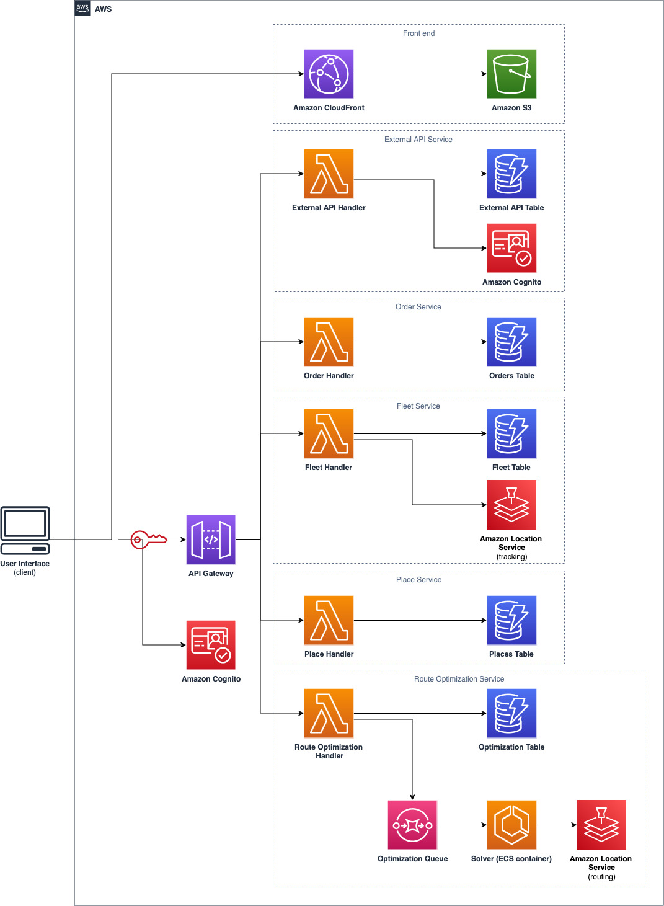

# Route Optimization Accelerator (ROA)

**Route Optimization Accelerator** helps you run linear optimization tasks to solve vehicle routing and traveling salesman problems. It leverages [Amazon Location Service](https://aws.amazon.com/location/) for routing decisions and [timefold](https://timefold.ai/) for constraint programming. It supports capacity constraint, time window constraint, duration constraint and more which can be configured on demand to meet your requirements.

Route Optimization Accelerator provides a WebUI and APIs that helps you to manage your Route Optimization Tasks along with the respective entities (orders, fleet and places).

## High Level Architecture



## Folder Structure

```sh
.
├── docs                          # folder that contains the documentation
├── packages                      # packages folder
│   ├── api
│   │   ├── web-api               # Web API implementation
│   │   └── web-api-service       # Web API definition using Smithy
│   ├── infra-app                 # main CDK entry point, it implements the infrastructure as code
│   ├── infra-common              # CDK project that has the common components used across the project
│   ├── route-optimization
│   │   ├── optimization-engine   # optimization engine written in Java
│   │   ├── optimization-infra    # CDK code that implements the optimization infrastructure
│   │   └── routing-engine        # CDK project that initialise the routing engine entities
│   └── web-ui                    # ReactJS application for the UI
└── projenrc                      # projen definition for the entire project
```

## Requirements

This project uses a series of tools

- [AWS CLI verison 2](https://docs.aws.amazon.com/cli/latest/userguide/getting-started-install.html)
- Java
  - [Corretto 17](https://docs.aws.amazon.com/corretto/latest/corretto-17-ug/downloads-list.html)
  - [Maven](https://maven.apache.org/)
- [NodeJS](https://nodejs.org/en) - >=18 with [pnpm](https://pnpm.io/)
- [Docker](https://www.docker.com/)

## Getting started

To get started with Route Optimization Accelerator you can follow one of the links below:

- [Getting started](./packages/infra-app/README.md) - To deploy the accelerator in your AWS Account
- [Detailed documentation](./docs/README.md) - To get more details about this project
- [Developer guide](./docs/dev/README.md) - In case you'd like to extend this accelerator

---

## Security

See [CONTRIBUTING](CONTRIBUTING.md#security-issue-notifications) for more information.

## License

This library is licensed under the MIT-0 License. See the [LICENSE](./LICENSE) file.
