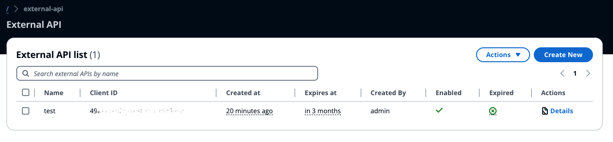

# External API Service

The accelerator provides you with a way to define External APIs key that can be used to integrate with the system. This will allow developers to integrate the accelerator with existing systems and automate certain operations. In case you would like to report a vehicle's current position to enable real-time tracking or automatically create optimization tasks this functionality would help you.

External APIs are valid for **up to 1 year** and can be disabled on demand.

**Important**: In the current implementation external APIs are not scoped down to specific service, they provide full access (read-write) to the accelerator's functionalities. User management it's not available at application level either, which means that users that have access to the Web UI can perform any action.
