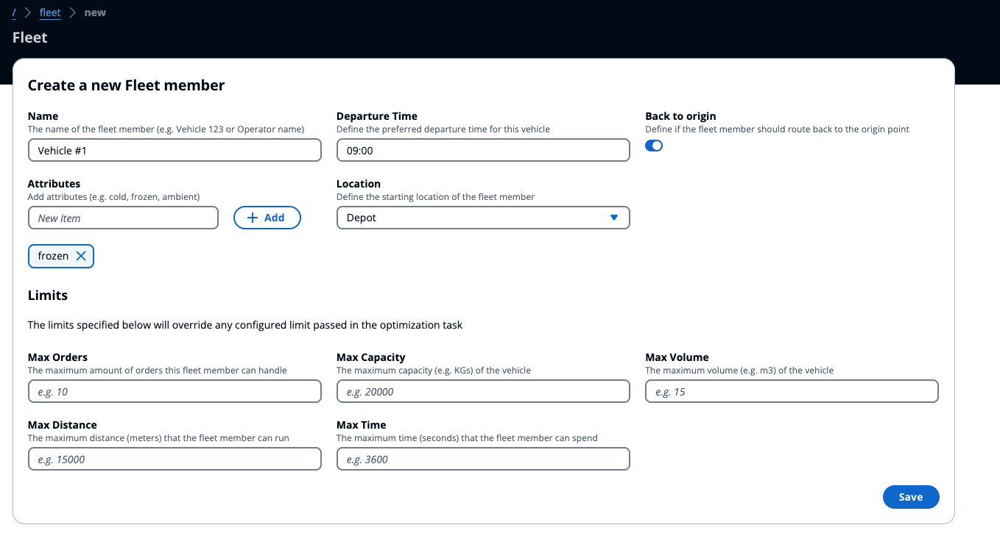

# FLeet Service

The fleet service allow you to abstract vehicles or field technicians/sales staff that have to visit multiple locations to perform their daily duties. Each fleet member would have the following required fields:

- **Name**: to provide a descriptive label to the member
- **Departure Time**: to define the time of the day when the specific fleet member would go out to perform their duties
- **Location**: the origin point where the fleet member depart from (generally a depot)

By default, every fleet member would be routed to go back to their origin point once the orders assigned to them are fulfilled, but the behaviour can be defined by flagging the _"Back to origin"_ field.

## Fleet Attributes

In order to pre-filter what a specific fleet member can do, a list of attribute can be included so that orders would be assigned to them accordingly. For example, for vehicle that can deliver frozen goods, we could apply the attribute `frozen` while for field technicians we could add their specific skills (e.g. `plumber`, `electrician`).

This information will be used in combination to the [order's requirement](../order/README.md#requirements), to assign specific orders only to vehicle/staff that can actually perform them.

## Fleet Limits

You can use this configuration of the fleet member to override the limits that would be provided during the creation of the [optimization task](../optimization/README.md). By default, all fleet member, if not specified differently, would inherit the limits from the optimization task. In case you want to override this behavior for a specific fleet member, you can use the fleet limits configuration.

The information that could be provided are the following:

- **Max Orders**: define the maximum number of orders that can be assigned
- **Max Distance**: define the maximum distance that fleet member can covered for one assignment
- **Max Time**: define the maximum time (which includes driving time, service time and waiting time) for one assignment
- **Max Capacity**: define the maximum capacity (e.g. in KGs) - useful for vehicles
- **Max Volume**: define the maximum volume (e.g. in m3) - useful for vehicles

One or more limits can be applied in combination to obtain the expected outcome.
