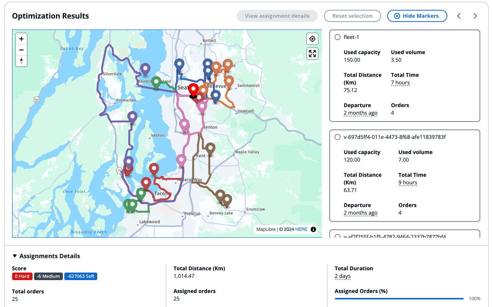

# Optimization Service

This is the most important service provided by this accelerator. It does use the entities that are described in this doc ([order](../order/README.md) and [fleet](../fleet/README.md)) to provide a optimal solution that meets your expected optimization goals.

This service runs optimization tasks asynchronously, by using an Amazon SQS queue to decouple the requests coming from the API and the compute layer which uses Amazon ECS tasks to run the linear optimization solver code (which uses [Timefold Solver Community Edition](https://github.com/timefoldai/timefold-solver))

This is a standalone service thata can use both the entities defined in the other services or provide custom one as long as they follow the require API Schema. The Web UI provides a way to simply add fleet member or orders that are already defined, but programmatically there's no difference between entities defined inside other services (fleet, order) or the one provided inline during the creation of optimization task.

## Fleet

This section helps you define the fleet to use for the specific optimization task. For more details on how to model your fleet you can visit the [fleet documentation](../fleet/README.md)

## Order

This section helps you define the orders to assign to the available fleet. For more details on how to model your orders you can visit the [order documentation](../order/README.md)

## Configuration

The task configuration is important to provide the exact behaviour that you want to drive from the solver. It has few sections which can be used to customise the behavior. All sections are optional, with default values that will be used in case nothing is provided.

### Basic Options

In this section you can configure the following fields:

- **Optimization Date**: the date of the optimization task (can be past or future), it include the vehicle's departure times and service window
- **Distance Matrix Type**: By default would be Road Distance, which uses Amazon Location Service to compute routing matrix details (time and distance) used by the solver. Can be changed to Air Distance, which uses the [Haversine Distance](https://en.wikipedia.org/wiki/Haversine_formula) to compute the matrix. This is significantly faster but highly inaccurate, it should be used for development purpose only.
- **Max Solver Duration**: the total maximum time that the solver can spend to find a solution
- **Max Unimproved Solver Duration**: the maximum time the solver should spend to find a new improved solution
- **Explain [Not implemented]**: if flagged, the solver would return - together with the optimization results - the score explainability.

### Vehicle Options

This section would force the vehicle limits to every fleet member that does not define them. The options that can be provided are the following:

- **Max Orders**: define the maximum number of orders that can be assigned
- **Max Distance**: define the maximum distance that fleet member can covered for one assignment
- **Max Time**: define the maximum time (which includes driving time, service time and waiting time) for one assignment
- **Max Capacity**: define the maximum capacity (e.g. in KGs) - useful for vehicles
- **Max Volume**: define the maximum volume (e.g. in m3) - useful for vehicles
- **Vehicle Departure Time**: when the vehicles would leave their respective depot
- **Back to origin**: whether it should be routed back to the original point (depot)
- **avoid tolls**: whether should avoid tolls during the routing

### Virtual Vehicles

The virtual fleet would be used to avoid overconstraint problems. If there aren't enough fleet member the solver would use the virtual fleet to assign orders to.

The virtual fleet has no difference compared to a normal vehicle, aside from the fact that can be defined in groups. The two additional information compared to the classic fleet provided in the [previous section](#fleet) are the following:

- **Group ID**: the ID of this group
- **Size**: how many vehicles are used in this group

In case there are homogenous vehicles with same limits and attributes, one group would be enough. Multiple groups are needed either when you have multiple depots or when you want to model a fleet with heterogeneous attributes (e.g. different limits)

### Weights

This configuration section is important to influence the solver's behaviour. Constraint are dynamically applied and disabled by the solver in case the specific request does not use certain features (e.g. if you don't implement the **Max Time** limit, the respective constraint isn't used).

Nonetheless, if you want to give more importance to the **distance** that the vehicle cover instead of the **time** spent, you could increase the weight of the respective constraint so that the solver's behaviour would adapt accordingly. Constraints can be disabled as well, by providing a `0`.

The available constraints are the following, grouped between `Hard`, `Medium` and `Soft`:

- **Late Arrival [Hard]**: used to penalise vehicles arriving too late at the destination (only applicable if you use service window)
- **Vehicle Volume [Hard]**: used to penalise vehicles exceeding thier allowed volume (only applicable if volume is provided)
- **Vehicle Weight [Hard]**: used to penalise vehicles exceeding thier allowed capacity (only applicable if weight is provided)
- **Max Distance [Hard]**: used to penalise vehicles exceeding thier allowed maximum distance (only applicable if max distance is provided)
- **Max Time [Hard]**: used to penalise vehicles exceeding thier allowed maximum time (only applicable if max time is provided)
- **Order Count [Hard]**: used to penalise vehicles exceeding thier maximum number of orders (only applicable if max order is provided)
- **Order Requirements [Hard]**: used to penalise vehicles that are not respecting the requirements (only applicable if order requirements are provided)
- **Early Arrival [Medium]**: used to penalise when a vehicle is too early at the destination (only applicable if you use service window)
- **Late Departure [Medium]**: used to penalise when a vehicle is departing after the end of the service window (e.g. it arrives on time but when after the service time it goes beyond the allowed limit - only applicable if you use service window)
- **Virtual Vehicle [Medium]**: used to penalise the usage of virtual vehicles (only applicable if virtual vehicles are configured)
- **Travel Distance [Soft]**: used to minimise the total travel distance (always used - unless disabled)
- **Travel Time [Soft]**: used to minimise the total travel time (always used - unless disabled)

**Hard** constraints cannot be violated (thus their final score should always be 0), **Medium** and **Soft** constraints are minimised by the solver as much as possible. Medium constraints are more important than soft constraints. In the current iteration it's not possible to change the constraint type but only its weight.

In order to have a correct behaviour, it's adivsed to:

- never disable hard constraints
- always penalise virtual vehicles
- always use at least one Soft constraint (or adjust their importance using the weight)

## Optimization Results

The Web UI will show the optimization results (which can be retrieved from the API as well):

> **Note**: the location points dislayed in this map have been generated randomly, some points might not make sense the way they are positioned

You can select the specific vehicle to have its route selected or click on "View assignment details" to get more details about the route and selected orders.
