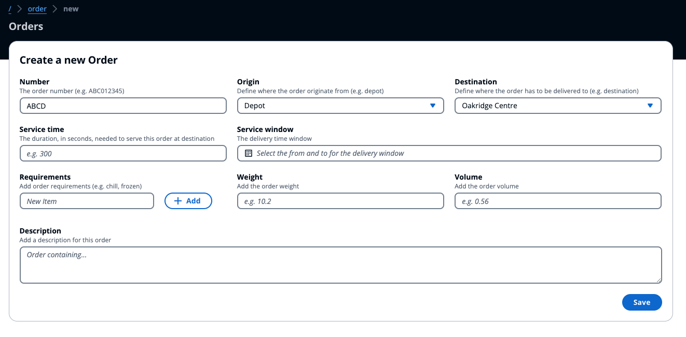

# Order Service

The order service would help to model incoming orders. It does require minimal information such as the order number, origin and destination. Additional information can be provided to influence the routing decisions.

# Servicing

To help model the optimization task to consider specific servicing requirements, you can provide the following information:

- **Service time**: to help to consider the time spent at the destination as working time
- **Service window**: to help define when the order can be delivered, these delivery windows would be used by the solver to arrange the order visits considering the for example the opening hours of a specific location.

## Requirements

The requirements list can be used to provide attributes to the orders that have to match the [fleet's attribute](../fleet/README.md#fleet-attributes). This would help to allow the solver to assign these orders only to fleet members that have the required characteristics (e.g. useful to map use-cases such as `frozen` food delivery or apply the right technicians for the tasks - `plumber` or `electrician` and so on)

## Attributes

Additional order attributes include `weight` and `volume`, which could be helpful if you've to add capacity and volume constraint for vehicle routing.
