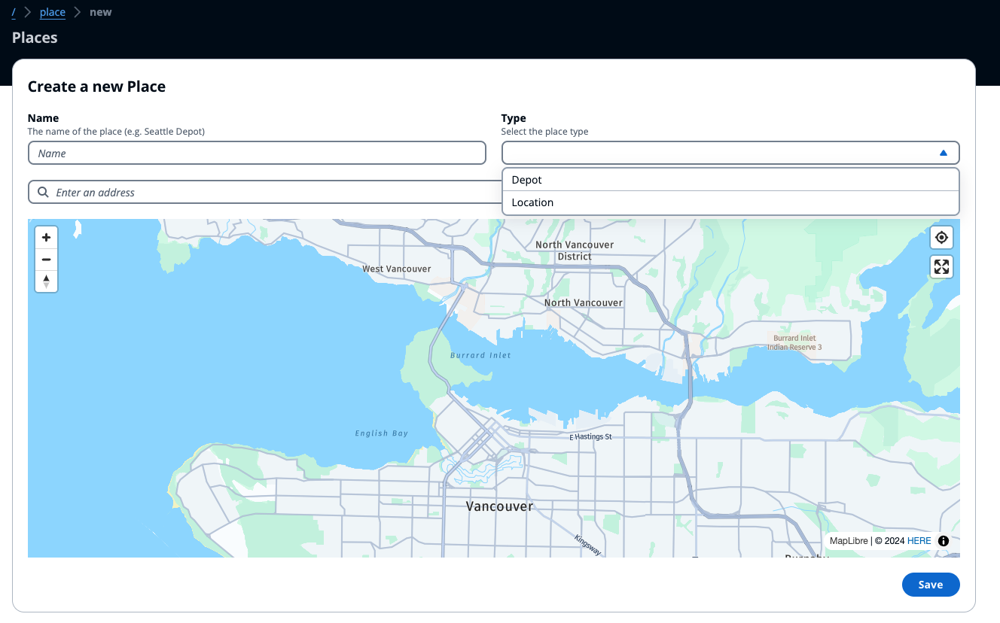

# Place Service

This service has the only purpose to map the existing places to be used easily when creating orders or fleet member from the Web UI.

Each place is composed of only few information:

- **Name**: to provide a descriptive name of the place
- **Type**: to define whether it's a `Depot` or a `Location`
- **Address**:: the physical address location of the place

The Web UI would you the Amazon Location Service' Places API to derive the `Latitude` and `Longitude` which would be stored together with the other information.
